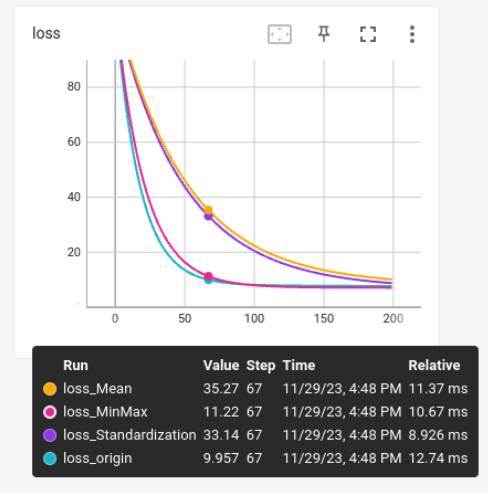
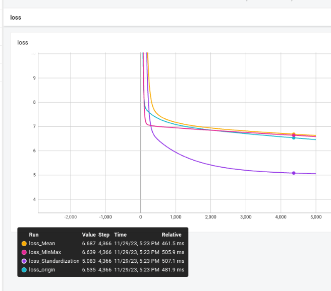
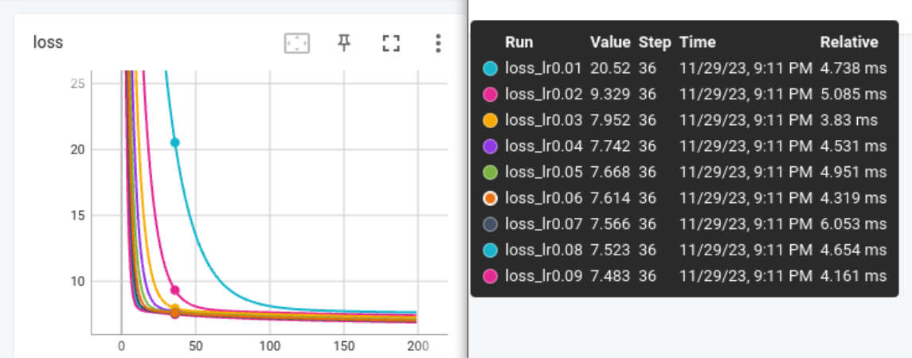
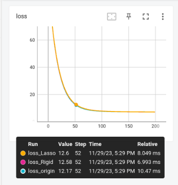
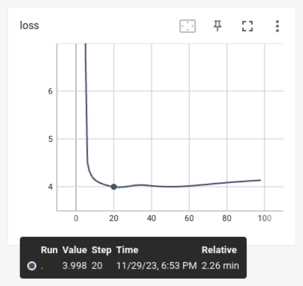

# 机器学习作业——鲍鱼年龄预测
董浩宇 502023150001

##  1. 实现方案
### 1.1 数据导入与数据类型
为了方便数据的管理与计算，我选用了numpy作为计算的工具。
在互联网将数据集（csv格式）下载到本地后，使用Pandas工具实现数据集的读取，然后将Pandas DataFrames数据格式统一转为numpy.float64格式进行存储与计算。在本次作业中，所有的数据类型均为numpy.float64。

在本次作业中，代码以及报告中的X代表数据集中的特征，而Y代表数据集中的结果，$\theta$表示模型参数。需要注意的是，为了能够将模型表示为： $\hat{Y}=X\theta$ 的形式，本文中的X与 $\theta$ 需要特殊处理，处理方式如下:
| 第1条数据 |1  | x1  |x2|...|xn|
|  ----   | ----  | ----  |---- |----|----|
| 第2条数据  | 1 | x1 |x2 |...|xn|
| ...  | ... | ... |...|...|xn|
| 第N条数据  | 1 | x1 |x2|...|xn|

| $\theta_0$ | 
|  ----   | 
| $\theta_1$|
|$\theta_2$|
|...|
|$\theta_n$  |

假设由N个特征，在第一个特征的前方添加一个恒定为1的特征。模型参数有N+1项，$\theta_0$表示的即为偏置项。使用这样的方法处理过后，只需要一个$\hat{Y}=X\theta$，就能够完整地表示出带有偏置项的线性回归模型。

### 1.2 对于性别的处理
鲍鱼的性别分为三种，M, F, and I (infant)，如果直接使用不同的数字对鲍鱼性别进行编码，可能无法很好地表示出不同性别对于鲍鱼寿命的影响。为了表示鲍鱼的性别，本次作业中选用了one-hot编码方式，对鲍鱼的性别进行编码。具体编码方式如下表：
|   特征\性别   | M  | F  |I|
|  ----   | ----  | ----  |---- |
| x1  | 1 | 0 |0 |
| x2  | 0 | 1 | 0|
| x3  | 0 | 0 |1|

将性别使用one-hot进行编码之后，总特征由8个变为11个。
### 1.3 使用梯度下降的方案
在本次作业中，梯度下降线性回归，岭回归与Lasso回归将使用梯度下降方法进行训练。这些方法的训练代价较低，训练速度较快，且使用梯度下降的方法也可以避免  $\hat{\theta}=(X^TX)^{-1} X^Ty$ 中 $(X^TX)^{-1}$不可逆的情况，使得训练过程更加稳定。

在本次作业中的梯度下降方法中，标准线性回归的梯度值为：

$$ \frac{\partial J(\theta)}{\partial\theta}=X^T(X\theta - y)$$
岭回归的梯度值为：
$$ \frac{\partial J(\theta)}{\partial\theta}=X^T(X\theta - y) + \lambda \theta '$$
Lasso回归的梯度值为：
$$ \frac{\partial J(\theta)}{\partial\theta}=X^T(X\theta - y) +  \lambda sgn(\theta ')$$

使用上方给出的梯度，即可进行梯度下降对模型进行训练。

### 1.4 使用直接计算的方案
由于局部加权线性回归的特点，对于每一个测试集中的数据，都需要算出不同的W，并且重新计算参数，如果使用梯度下降，则计算成本过高。因此本次作业中，局部加权线性回归使用直接计算的方案来获得参数。使用到的计算公式为：
$$\hat{\theta}=(X^TWX)^{-1} X^TWy$$
其中W为权重矩阵。使用此方法对于每一个测试集中的数据计算出一个模型，从而测试其拟合效果。

## 2. 实验结果

### 2.1 基于梯度下降的标准线性回归预测
#### 2.1.1 特征缩放对梯度下降的影响
  

上图代表不同特征缩放方法对梯度下降的影响，图中截取的是训练过程中的前200步。

在实验中，使用了相同的学习率，相同的训练集与测试集。从图中可以看出，使用特征缩放会放缓训练过程。但是不管使用什么样的训练方法，使用梯度下降进行训练最终都能收敛到相似的MSE Loss表现。

在模型的测试方面，本次作业中将所有模型使用相同的学习率（1e-2），相同的学习步数(5000)，进行训练。并且使用十折交叉验证的方法，将数据集进行评估，最终求出各种方法的MSE误差。
在最终进行1000步的训练后，各种特征缩放方法的预测MSE误差分别为：

|   特征缩放方法   | 不缩放  | MinMax  |Mean|Standardization|
|  :----:   | :----:  | :----:  |:----: | :----:|
|  MSE_Mean | 6.80 | 6.93 |6.98 |5.32|

能够看出，使用Standardization方法进行正则化，会降低训练的速度，但是能够明显降低MSELoss。

完整的训练对比曲线如上图。

#### 2.1.1 学习率对梯度下降的影响

上图为不同学习率下，200步内的损失曲线。
可以看出，学习率越高，梯度下降越快。

### 2.2 Lasso回归和岭回归
  

上图代表不同正则化方法对梯度下降的影响，在本次实验中，不使用特征缩放，图中截取的是训练过程中的前200步。可以看出正则化对于这个模型训练速度的影响几乎忽略不计。

完整的实验设置方法与1.中相同，使用相同的学习率（1e-2），相同的学习步数(5000)，对于正则化使用相同的$\lambda$(1e-1)。
|      | 不正则化  | 岭回归  |Lasso回归|
| :----:   |:----: | :----:  |:----: |
|  MSE_Mean | 6.80 | 7.49 |7.67 |

从表格中可以看出，使用正则化后，模型测试结果MSE误差增大。

|   参数   | 不正则化  | 岭回归  |Lasso回归|
|  :----:   | :----:  | :----:  |:----: |
|  $\theta_0$ | 4.57 | 7.61 |7.57 |
|  $\theta_1$ | 2.05 | 0.66 |0.39 |
|  $\theta_2$ | 1.79 | 0.41 |0.10 |
|  $\theta_3$ | 0.72 | -0.80 |-0.58 |
|  $\theta_4$ | 2.58 | 0.63 |0.17 |
|  $\theta_5$ | 2.22 | 0.57 |0.00 |
|  $\theta_6$ | 1.08 | 0.27 |0.00 |
|  $\theta_7$ | 1.83 | 1.66 |2.8 |
|  $\theta_8$ | -2.31 | 0.02 |0.00 |
|  $\theta_9$ | 0.08 | 0.27 |0.00 |
|  $\theta_{10}$ | 2.55 | 0.94 |0.00 |

上表展示了不同模型使用相同训练集训练出来的参数，可以很明显的看出，使用正则化方法后，模型的参数数值上变小了，而且对于Lasso回归，很多参数都变成了0，也就是说这一个特征与结果关系并不大，在模型中可以删除这一项。

从上面的表格中就能很清楚地看出正则化的意义。

### 2.3 局部加权线性回归
局部加权线性回归中有一个参数是k，在完成局部加权线性回归的代码后，首先对k取值的影响进行探究。

上图中，横轴乘0.01就是LWLR算法中取得k值，即k从0.05开始，每隔0.01计算一次局部线性加权回归，直到k取到1。可以看出在k取到0.2之后，局部线性回归的预测结果已经对k不是特别敏感了。

之后我取了k=0.2，进行十折交叉验证，得到的平均MSE如下：

|   k   | MSE_LOSS_mean  | 
|  :----:   | :----:  | 
|  0.2 |    4.7 |

可以看出，相较于其他的方法，局部加权线性回归的MSE误差最小。但是运行局部加权线性回归程序所需要的时间也是最长的。

### 2.4 影响鲍鱼年龄的主要因素

|   参数   | 参数对应特征 |不正则化  | 岭回归  |Lasso回归|
|  :----:   | :----:| :----:  | :----:  |:----: |
|  $\theta_0$ |常数| 4.57 | 7.61 |7.57 |
|  $\theta_1$ |性别为Female| 2.05 | 0.66 |0.39 |
|  $\theta_2$ |性别为Male| 1.79 | 0.41 |0.10 |
|  $\theta_3$ |性别为Infant| 0.72 | -0.80 |-0.58 |
|  $\theta_4$ |Length| 2.58 | 0.63 |0.17 |
|  $\theta_5$ |Diameter| 2.22 | 0.57 |0.00 |
|  $\theta_6$ |Height| 1.08 | 0.27 |0.00 |
|  $\theta_7$ |Whole weight| 1.83 | 1.66 |2.8 |
|  $\theta_8$ |Shucked weight| -2.31 | 0.02 |0.00 |
|  $\theta_9$ |Viscera weight| 0.08 | 0.27 |0.00 |
|  $\theta_{10}$ |Shell weight| 2.55 | 0.94 |0.00 |

综上上文多种模型的预测结果（特别是正则化回归结果），影响鲍鱼年龄的主要因素有Sex，Whole Weight以及Length。性别为Female与鲍鱼年龄正相关，而性别为Infant与鲍鱼年龄负相关，Whole Weight以及Length与鲍鱼年龄正相关。

## 3. 不同模型的比较
使用相同的超参数对上文的所有模型进行测试，得到最终的MSE误差结果为：
|      | 标准梯度下降  | 岭回归  |Lasso回归|局部加权线性回归|
| :----:   |:----: | :----:  |:----: |:----: |
|  MSE_Mean | 6.80 | 7.49 |7.67 |4.7|
|  Run_Time(ms) | 634 | 602 |650 |6650|

可以看出局部加权线性回归的拟合能力明显强于其他的模型，但是局部加权线性回归计算量非常大，计算所需要的时间远远高于其他的算法，另外三种算法时间相差不大，可以认为时间复杂度相同。